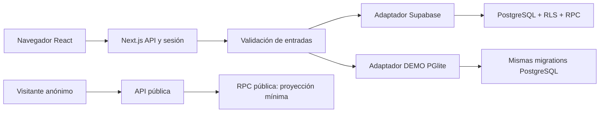

# Arquitectura

Estado del documento: describe el diseño implementado en este repositorio; las pruebas ejecutadas se registran por separado en [VERIFICATION.md](VERIFICATION.md).

## Monolito modular

Next.js App Router sirve las pantallas React y las rutas API del mismo origen. TypeScript describe el contrato compartido; Tailwind aplica la presentación. El servidor valida entradas, obtiene la identidad y envía las acciones al adaptador de datos. PostgreSQL mantiene estados, relaciones, autorización e integridad. No se necesitan microservicios para este MVP.

## Contrato de aplicación

- `GET /api/state`: snapshot con RLS acotado al titular, membresías y observación académica autorizada; organizaciones, skills y retos abiertos son descubribles para usuarios autenticados.
- `POST /api/actions`: acción de negocio y payload validados; la base comprueba las autorizaciones nuevamente.
- `POST /api/auth`: registro/login/logout reales o selección explícita de personaje DEMO.
- `GET /api/public`: SkillPass por slug o credencial por UUID, sin exigir login y sin devolver tablas privadas completas.
- `/auth/callback`: intercambio de código de Supabase para establecer la sesión.

Las RPC `nexus_snapshot`, `nexus_action`, `nexus_public_skillpass` y `nexus_public_credential` delimitan la API de datos. Los nombres concretos y firmas se encuentran en las migrations. El navegador no determina su propio `user_id`, rol, estado verificado ni organización autorizada.

## Dos adaptadores, evidencia distinta

Producción usa Supabase Auth y el JWT del usuario para consultas/RPC. La autorización no depende de esconder botones. La aplicación no utiliza una clave service role para atender solicitudes ordinarias.

La DEMO ejecuta PostgreSQL mediante PGlite, carga las migrations y fixtures ficticios y conserva sus cambios en disco. El servidor asocia una cookie firmada a una identidad DEMO y permite cambiar de personaje dentro del mismo escenario. La cookie vence después de ocho horas desde su emisión o renovación; ese vencimiento no borra los datos en disco ni los enlaces públicos. Su identificador público no autentica al visitante. Este adaptador sirve para probar transiciones y enseñar el producto sin secretos, pero no demuestra correo, refresh token, infraestructura Supabase ni durabilidad serverless.

El adaptador local serializa operaciones y cierra bases inactivas para mantener un máximo de tres abiertas. Cada escenario conserva un manifiesto de migraciones; se aplican las nuevas al abrirlo. `demo:serve` permite usar el build de producción con una clave local generada automáticamente. Es una operación de un único proceso y disco persistente, no una solución de hosting distribuido.

## Transacción de confianza

1. Estudiante participa en un reto y registra una experiencia con habilidades.
2. Agrega evidencia HTTPS, eligiendo si puede exponerse públicamente.
3. Solicita revisión; desde ese punto el registro no se puede alterar silenciosamente.
4. Un supervisor de la organización autorizada aprueba, solicita cambios o rechaza. Nunca puede autoaprobarse.
5. La aprobación registra validador, organización, fecha, comentario, rating y horas verificadas; cambia el estado y crea credencial y sus habilidades dentro de una transacción.
6. SkillPass y métricas se derivan de esos registros. La revocación invalida el reconocimiento y excluye sus horas y habilidades de agregados vigentes.

## Decisiones de alcance

Evidencia por URL y metadatos evita abrir una superficie de carga de archivos sin controles completos. IA y pagos no son dependencias. El rating MVP es una evaluación general aplicada a las habilidades seleccionadas, no una prueba psicométrica ni una rúbrica calibrada por competencia. Publicar SkillPass es una decisión explícita del titular. Las credenciales revocadas preservan su estado para no seguir apareciendo válidas.

## Evolución 2026–2030

Los identificadores estables y las relaciones entre experiencia, evidencia, organización, validador y habilidad permiten añadir una API externa, mejores rúbricas, interoperabilidad y analítica longitudinal. Skill intelligence, talent graph, matching, apps nativas y credenciales criptográficas son PLAN/HIPÓTESIS, no capacidades existentes. La modularidad del adaptador permite crecer sin convertir la arquitectura futura en una promesa de producto actual.
