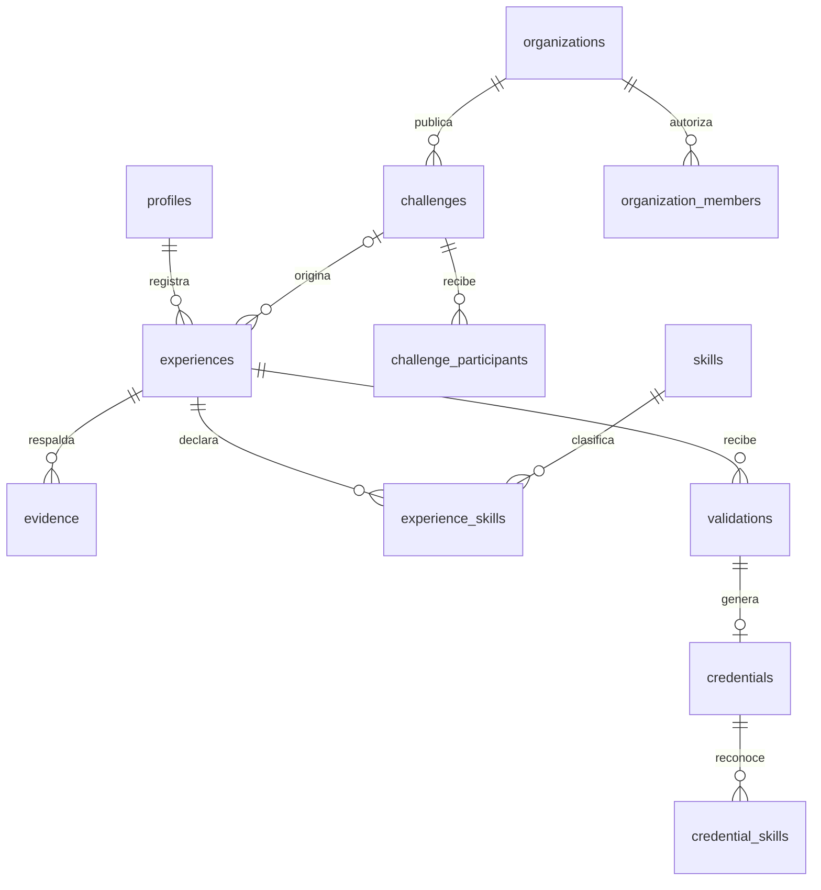
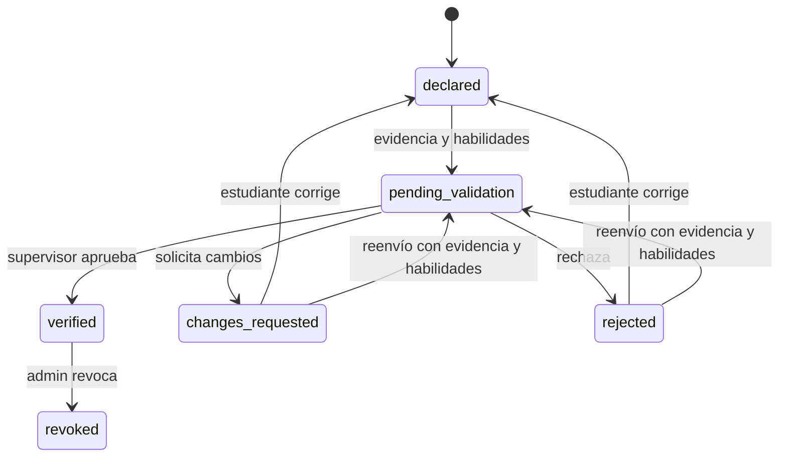

# Modelo de datos

La fuente normativa es `supabase/migrations/`; este documento explica sus relaciones e invariantes. El esquema usa UUID, claves foráneas, restricciones y timestamps. Los archivos de prueba documentan qué invariantes se ejecutaron; ver [VERIFICATION.md](VERIFICATION.md).

## Entidades

| Entidad | Propósito y relación principal |
| --- | --- |
| `profiles` | Perfil profesional vinculado a `auth.users`, rol global, slug estable y consentimiento público |
| `organizations` | Empresa, universidad, nonprofit, gobierno o AINDEV |
| `organization_members` | Membresía y rol autorizado dentro de una organización |
| `skills` | Catálogo extensible técnico, negocio y humano |
| `challenges` | Reto perteneciente a una organización, fechas, modalidad y estado |
| `challenge_skills` | Habilidades objetivo del reto |
| `challenge_participants` | Participación del estudiante, sin duplicar pareja reto/estudiante |
| `experiences` | Trabajo del estudiante, organización, reto opcional, responsabilidades, entregables, horas y estado |
| `experience_skills` | Habilidades declaradas en esa experiencia |
| `evidence` | URL HTTPS, tipo, descripción y consentimiento público por pieza |
| `validation_requests` | Solicitud y estado de la revisión de una experiencia |
| `validations` | Decisión humana, autor, organización, comentario, rating y horas aceptadas |
| `credentials` | Reconocimiento de una aprobación concreta; estado vigente o revocado |
| `credential_skills` | Habilidades y nivel documentados por esa credencial |
| `activity_events` | Eventos de negocio auditables generados por acciones del servidor/base |

`student_skills` es una vista SQL con `security_invoker=true` que deriva habilidades de experiencias verificadas y credenciales activas, evitando que una tabla mutable separada pueda afirmar “verificada” sin respaldo. Expone estudiante, skill, nivel máximo y número de experiencias con reconocimiento vigente. La habilidad verificada se deriva de una credencial vigente y una aprobación; una habilidad sólo asociada a una experiencia permanece autodeclarada.

Las entidades principales tienen UUID propios; las tablas de relación usan claves compuestas de UUID para impedir duplicados. Las migrations añaden `created_at` y `updated_at`, con trigger de actualización. `validation_requests` agrega `completed_at`; las credenciales registran `issued_at` y `revoked_at`. La organización de una validación se obtiene de su experiencia y la persona revisora se guarda en `reviewer_id`.

## Estados y transiciones

No hay borrado destructivo de experiencias desde el MVP. Una experiencia en revisión o verificada no debe modificarse para cambiar retroactivamente aquello que se validó. La aprobación y emisión son atómicas, y las horas verificadas no exceden las horas declaradas. El supervisor se determina por membresía, no por un campo editable enviado por el estudiante. La revocación conserva trazabilidad y retira el reconocimiento de métricas vigentes.

`experiences.status='verified'` es el estado de experiencia aprobada. En la tabla `credentials`, su reconocimiento vigente usa `status='active'`; la interfaz pública lo presenta como `VERIFIED`. Una revocación usa `revoked` en ambas tablas. `INVALID / NO DISPONIBLE` es una respuesta de presentación para registros inexistentes o no publicados, no un estado almacenado de credencial.

## Métricas

- **Applied Hours:** suma de horas declaradas del conjunto de experiencias autorizado. Son declaración del titular, no horas certificadas.
- **VATH:** suma de horas aceptadas en experiencias con aprobación y credencial vigente. Pendientes, rechazadas, cambios solicitados y revocadas no aportan VATH.
- **Verified Experiences:** experiencias con reconocimiento vigente, no cantidad acumulada de decisiones de revisión.
- **Verified Skills:** habilidades distintas vinculadas a credenciales vigentes. Una habilidad repetida en dos experiencias no son dos habilidades distintas.
- **Verification rate:** si se calcula, indicar numerador, denominador, periodo y tratamiento de revocadas; no usar un porcentaje sin definición.
- **IVC, colocación e ingresos:** fuera de esta versión; no se deducen a partir de horas o ratings.

La calificación 1–5 es una evaluación del supervisor aplicada a las habilidades de la experiencia. No equivale a una escala validada de empleabilidad ni a certificación académica.

## Privacidad y seed

Un SkillPass público es una proyección mínima, no un dump del snapshot interno. Requiere perfil publicado; únicamente se exponen experiencias con credencial, incluida su historia revocada, y evidencia marcada pública. Incluye la identidad profesional del titular, nombre de la organización y nombre de la persona revisora de la aprobación. Correos, comentarios privados, razón interna de revocación, membresías y bitácora no forman parte de la respuesta pública.

Un observador universitario puede consultar el resumen de experiencias, credenciales y habilidades de alumnos vinculados a su universidad. Esa relación académica no le concede la evidencia privada ni los comentarios de revisión de otra organización. El catálogo de organizaciones, skills y retos abiertos es descubrible por usuarios autenticados; aislamiento organizacional no significa ocultar ese directorio.

El seed marca registros ficticios como DEMO. Los UUID de personajes son fijos para reproducibilidad y no son contraseñas. En Supabase, los perfiles dependen de usuarios Auth existentes; no crear cuentas reales insertando fixtures directamente en `auth.users`. El adaptador local usa un contexto Auth de prueba aislado para ejecutar SQL. Ver el encabezado de `supabase/seed.sql` para el procedimiento permitido.
